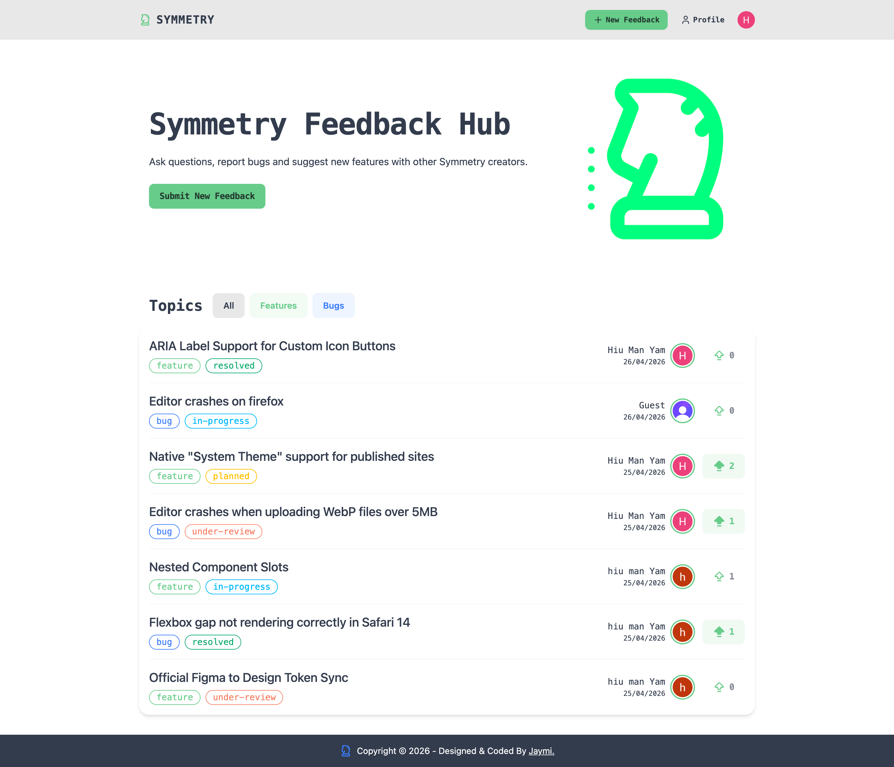
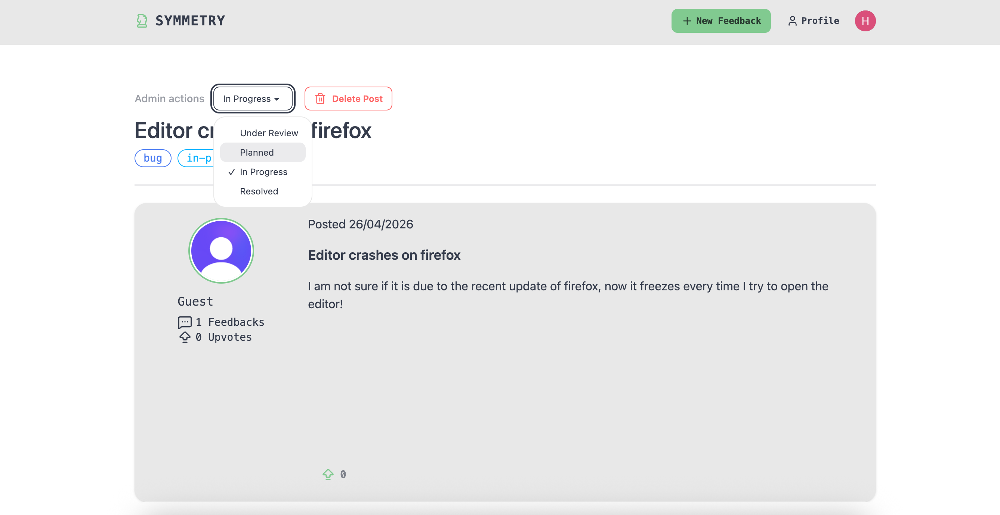

# Symmetry Feedback Hub: Features Feedback & Bug Reporting Platform

A professional-grade feedback management system built for web design platforms. This project facilitates seamless communication between users and administrators, featuring a robust voting system, commenting functionality, and granular administrative controls.

## 🚀 Live Demo

[Live Demo](https://symmetry-feedback-hub.vercel.app/)

## Screenshot

Homepage

Admin actions

## 🛠 Tech Stack

### Frontend

- **Framework:** React 18 (Vite)
- **State Management:** TanStack Query (React Query) for server-state & caching.
- **Authentication:** Clerk (Social Login & RBAC).
- **Styling:** Tailwind CSS & DaisyUI (UI Component Library).
- **Icons:** Lucide React.
- **Routing:** React Router 6.

### Backend

- **Runtime:** Node.js (Express.js).
- **Database:** NeonDB (Serverless PostgreSQL).
- **ORM:** Drizzle ORM.
- **Security:** Clerk Express Middleware for JWT verification.

## ✨ Key Features

### 🔐 Advanced Authentication & RBAC

- **Role-Based Access Control:** Implemented distinct User and Admin roles using Clerk's `publicMetadata`.
- **Protected Actions:** Admins have exclusive access to administrative panels to delete content or update post statuses (e.g., Planned, In Progress, Resolved).

### ⚡ Resilient UI

- **Dynamic Author Stats:** Real-time calculation of author feedback count and total upvotes received across all posts.
- **Smooth Navigation:** Custom `ScrollToTop` behavior and specialized 404/Error handling to ensure a production-ready feel.

### 💬 Engagement System

- **Posting:** Full CRUD functionality for feedback posts with ownership-based deletion logic.
- **Comment Threads:** Full CRUD functionality for comments with ownership-based deletion logic.
- **Interactive Statuses:** Visual badges for post types (Bug, Feature) and lifecycle statuses.

### 🏗 Architecture & Design

- **Relational Database Design:** Optimized PostgreSQL schema with foreign key constraints and indexed relations for efficient querying.
- **Responsive Design:** Fully mobile-responsive layout using the DaisyUI chat and card systems.

### 📈 Future Roadmap

[ ] Nested comment replies.

[ ] Email notifications via Resend for status updates.

[ ] Advanced search and multi-tag filtering.

[ ] User profile pages with activity heatmaps.

### 📄 License

Distributed under the MIT License. See LICENSE for more information.
